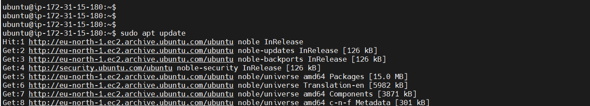
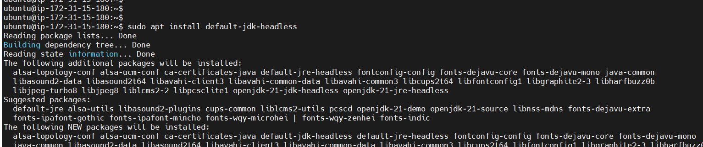
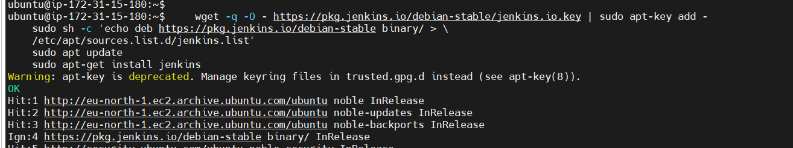
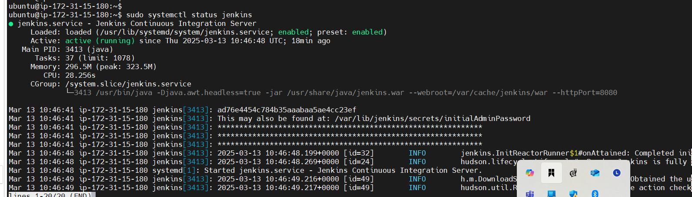
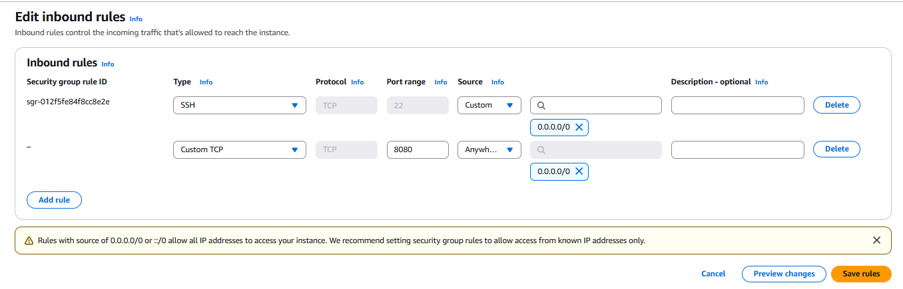
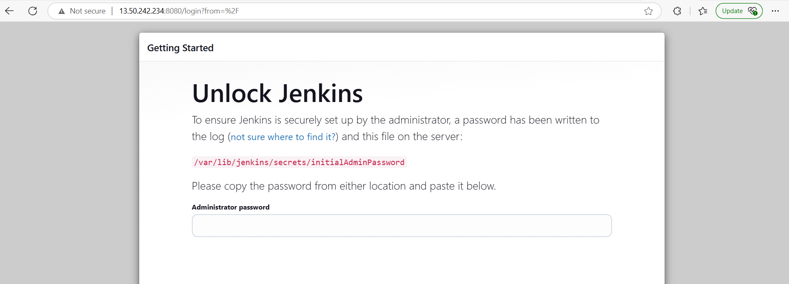
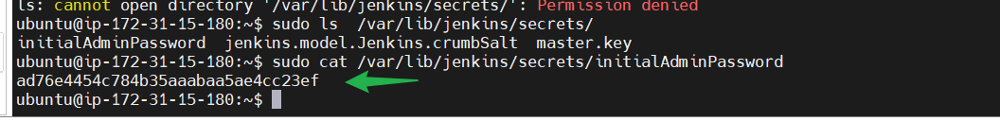
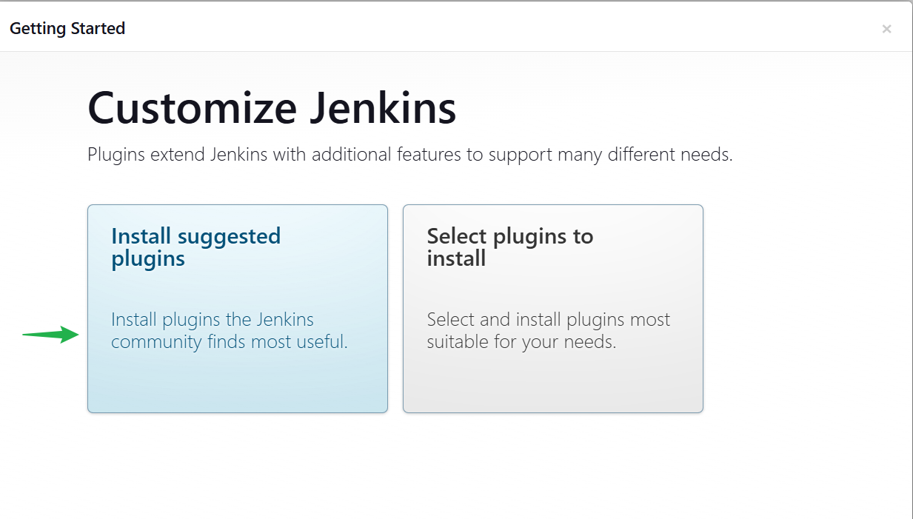
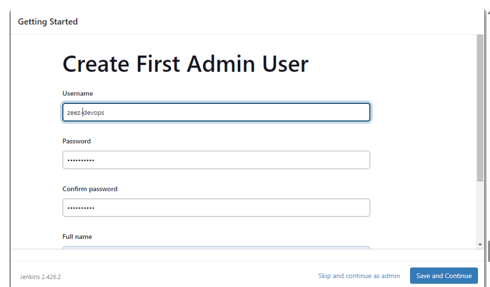
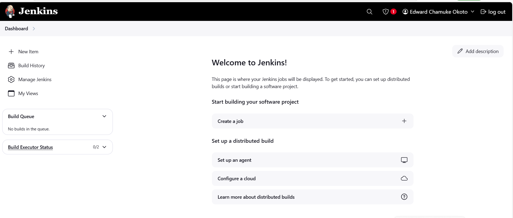

# Introduction-to-JENKINS

**Continuous Integration and Continuous Delivery (CI/CD)** is a software development practice that automates and streamlines the process of integrating code changes, testing them, and deploying applications. 

- **Continuous Integration (CI):**  
  Developers frequently commit code to a shared repository. Each change automatically triggers builds and tests, ensuring that new code integrates smoothly with the existing codebase and that any issues are identified early.

- **Continuous Delivery/Deployment (CD):**  
  After a successful integration and testing phase, the code is automatically prepared for release. Continuous Delivery ensures that the software is always in a deployable state, while Continuous Deployment goes a step further by automatically deploying every change to production once it passes the testing phase.

Overall, CI/CD improves development efficiency, accelerates product releases, and reduces the risk of bugs in production by promoting an automated, consistent, and rapid development workflow.


### What is JENKINS.

Jenkins is an open-source automation server that plays a key role in continuous integration and continuous delivery (CI/CD). It automates the building, testing, and deployment of software, ensuring that code changes are integrated frequently and reliably. Jenkins achieves this through a rich ecosystem of plugins, which allow it to integrate seamlessly with various tools and technologies used in modern development workflows. This makes it an essential tool for agile teams and DevOps practices, streamlining the path from code commit to production deployment.

### Getting Started with JENKINS

INSTALLATION OF JENKINS

-We shall be working on a linux operating system.

LOG ONTO TO YOUR LINUX SERVER

**Update package repositories**


```bash
sudo apt update
```

The command is used on Debian-based systems (like Ubuntu) to refresh the package lists from the repositories. This means it downloads the latest package information, allowing you to see if there are newer versions available. It’s an essential step before installing or upgrading packages to ensure you're working with the most current information on available software.

 

**Install JDK**


```bash
sudo apt install default-jdk-headless
```

The command installs the **default Java Development Kit (JDK) for headless environments** on your Ubuntu system. Here's what that means:

- **Default JDK:**  
  This package provides the standard JDK recommended for your version of Ubuntu. It allows you to compile and run Java applications.

- **Headless:**  
  The term "headless" indicates that the package does not include the graphical components (like GUI libraries) typically part of the full JDK. This is ideal for server environments or situations where you don't need a graphical interface, reducing resource usage.

- **Usage Scenario:**  
  Use this command when you need to run or develop Java applications on a server or any environment without a display, such as a cloud instance or in automated build pipelines.

After running this command, you'll have the essential tools needed to compile and run Java applications without the overhead of GUI-related components.

  

 **Install JENKINS**

     wget -q -O - https://pkg.jenkins.io/debian-stable/jenkins.io.key | sudo apt-key add -
    sudo sh -c 'echo deb https://pkg.jenkins.io/debian-stable binary/ > \
    /etc/apt/sources.list.d/jenkins.list'
    sudo apt update
    sudo apt-get install jenkins


   

 The command installs jenkins.It involves importing the jenkins GPG key for package verification,adding the jenkins repository to the system sources, updating package list and finally,installing jenkins through the package manager(apt-get)

 **Check if JENKINS has been installed,up and running**

    sudo systemctl status jenkins

 

**In our instance,create new inbound rule for port 8080 in security group**

By default,JENKINS listen on port 8080.We need to create an inbound rule for this in our security group of our instance.

  

**Set up Jenkins on a Web Console**

a)Input your JENKINS instance ip address on your web browser.
`http://public_ip:8080`

 

b) On your Jenkins instance, check `var/lib/jenkins/secrets/initialAdminPassword` to know your password

 

c) Install suggested pluggins

 

d) Create a User Account

  

e) Log into the JENKINS Console

  

JENKINS HAS BEEN SUCCESSFULLY INSTALLED CAN BE ACCESSED ON THE JENKINS CONSOLE/DASHBOARD on the web.

### TEST CARRIED OUT

1.Pre-Installation Tests
Package Repository Update:

Ran sudo apt update to ensure that the package lists were refreshed, confirming the Ubuntu system was up-to-date.

JDK Installation Verification:

Executed sudo apt install default-jdk-headless and confirmed that the headless JDK was installed. This step was essential because Jenkins requires Java to run.

2.Jenkins Installation Verification
Repository Setup and Installation:

Imported the Jenkins key and added the Jenkins repository.

Ran sudo apt update again to include the Jenkins packages.

Installed Jenkins using sudo apt-get install jenkins with no errors.

Service Status Check:

Executed sudo systemctl status jenkins and confirmed that the Jenkins service was active and running.

Reviewed the service logs for any initial errors or misconfigurations.

3.Network Connectivity & Firewall Tests
Port 8080 Accessibility:

Confirmed that the server’s security group allowed inbound traffic on port 8080 (the default port for Jenkins).

Performed a connectivity check by accessing http://<your_public_ip>:8080 in a web browser, which successfully loaded the Jenkins splash screen.

Command-Line Connectivity:

Optionally, used curl http://<your_public_ip>:8080 from another machine to ensure that the Jenkins web interface was reachable.

4.Initial Jenkins Setup Testing
Retrieving the Initial Admin Password:

Ran sudo cat /var/lib/jenkins/secrets/initialAdminPassword to obtain the password.

Used the password to unlock the Jenkins UI for its initial setup.

Plugin Installation:

Verified that the suggested plugins installed correctly from the Jenkins dashboard.

User Account Creation:

Followed the on-screen steps to create a new administrator user, confirming that the user management process is working correctly.


    