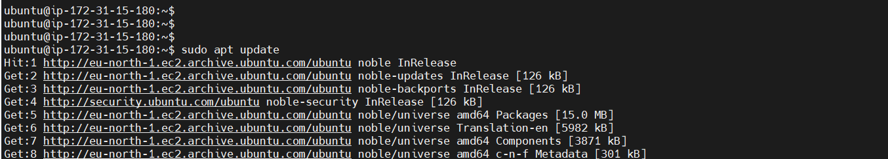
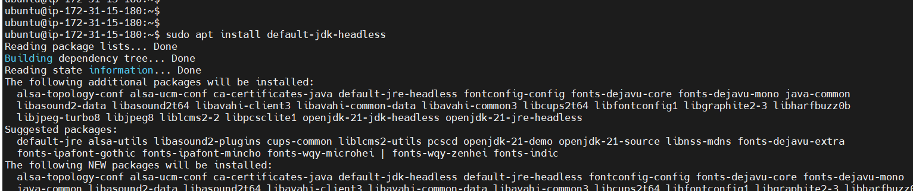
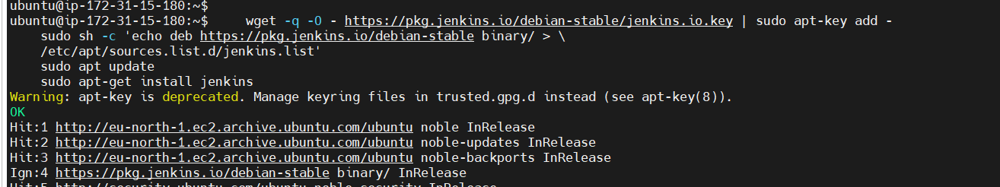
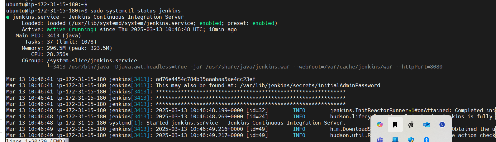
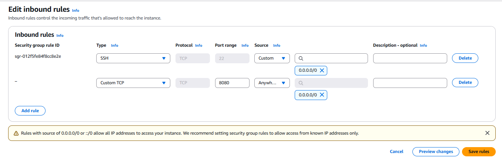
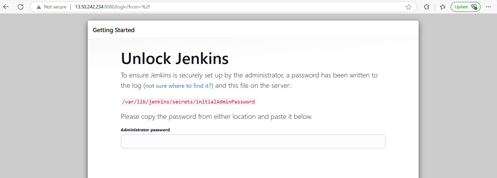
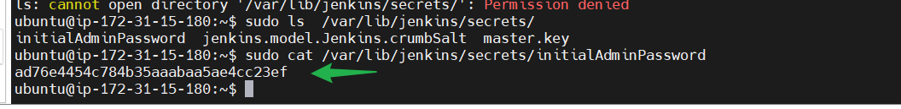
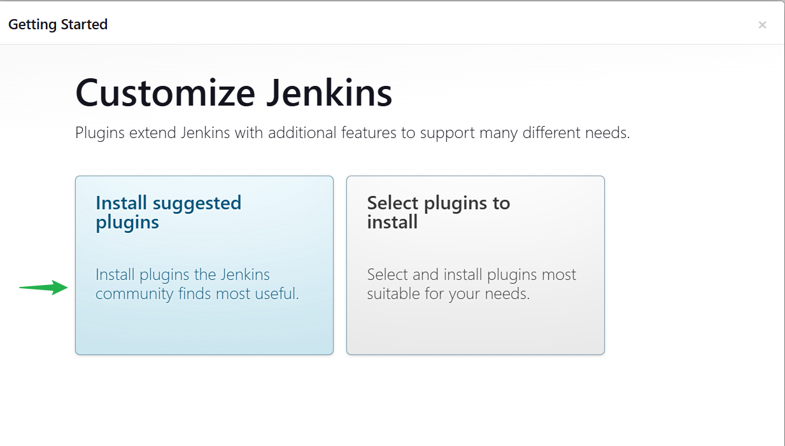
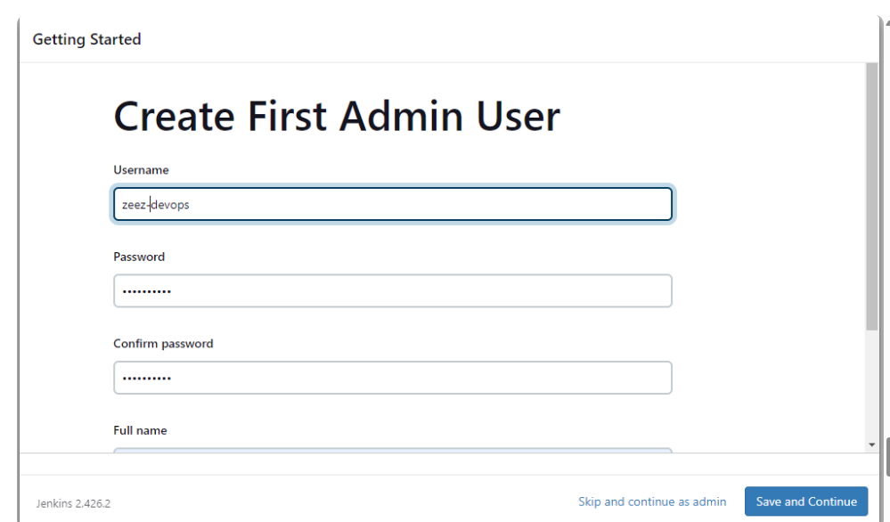
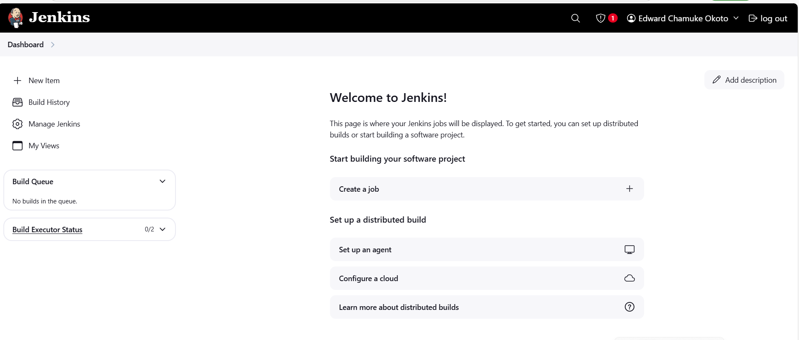

# Introduction-to-JENKINS

**Continuous Integration and Continuous Delivery (CI/CD)** is a software development practice that automates and streamlines the process of integrating code changes, testing them, and deploying applications. 

- **Continuous Integration (CI):**  
  Developers frequently commit code to a shared repository. Each change automatically triggers builds and tests, ensuring that new code integrates smoothly with the existing codebase and that any issues are identified early.

- **Continuous Delivery/Deployment (CD):**  
  After a successful integration and testing phase, the code is automatically prepared for release. Continuous Delivery ensures that the software is always in a deployable state, while Continuous Deployment goes a step further by automatically deploying every change to production once it passes the testing phase.

Overall, CI/CD improves development efficiency, accelerates product releases, and reduces the risk of bugs in production by promoting an automated, consistent, and rapid development workflow.


### What is JENKINS.

Jenkins is an open-source automation server that plays a key role in continuous integration and continuous delivery (CI/CD). It automates the building, testing, and deployment of software, ensuring that code changes are integrated frequently and reliably. Jenkins achieves this through a rich ecosystem of plugins, which allow it to integrate seamlessly with various tools and technologies used in modern development workflows. This makes it an essential tool for agile teams and DevOps practices, streamlining the path from code commit to production deployment.

Prerequisites
- A Linux-based operating system (e.g., Ubuntu).
- Root or sudo access to the Linux server.


### Getting Started with JENKINS

#### Installation of Jenkins

- log to the ubuntu server

**Update package repositories**


```bash
sudo apt update
```

- The command is used on Debian-based systems (like Ubuntu) to refresh the package lists from the repositories. This means it downloads the latest package information, allowing you to see if there are newer versions available. It’s an essential step before installing or upgrading packages to ensure you're working with the most current information on available software.

 

**Install (java) JDK**


```bash
sudo apt install default-jdk-headless
```

The command installs the **default Java Development Kit (JDK) for headless environments** on your Ubuntu system. Here's what that means:

- **Default JDK:**  
  This package provides the standard JDK recommended for your version of Ubuntu. It allows you to compile and run Java applications.

- **Headless:**  
  The term "headless" indicates that the package does not include the graphical components (like GUI libraries) typically part of the full JDK. This is ideal for server environments or situations where you don't need a graphical interface, reducing resource usage.

- **Usage Scenario:**  
  Use this command when you need to run or develop Java applications on a server or any environment without a display, such as a cloud instance or in automated build pipelines.

After running this command, you'll have the essential tools needed to compile and run Java applications without the overhead of GUI-related components.

  

 **Install JENKINS**

 1}  Add the Jenkins GPG key for package verification
    
  ```
  wget -q -O - https://pkg.jenkins.io/debian-stable/jenkins.io.key | sudo apt-key add -
  ```
  
 2}  Add the jenkins repository

  ```
  sudo sh -c 'echo deb https://pkg.jenkins.io/debian-stable binary/ > \ /etc/apt/sources.list.d/jenkins.list'

  ```
 
 3} This ensures access to the latest package versions available in the repositories.

   ```
    sudo apt update
    sudo apt-get install jenkins
   ```

   

 Theses command installs jenkins.It involves importing the jenkins GPG key for package verification,adding the jenkins repository to the system sources, updating package list and finally,installing jenkins through the package manager(apt-get)

 #### Verify Jenkins Installation

 Check if JENKINS has been installed,up and running
 
  ```
  sudo systemctl status jenkins
 
  ```

  - If `active` , jenkins is successfully installed.

 

 ### Configure Network Setting

**In our instance,create new inbound rule for port 8080 in security group**

By default, Jenkins listens on port **8080**. Ensure this port is open for inbound traffic in your instance’s security group:
- **Create a new inbound rule** for port **8080** in your cloud provider’s security group.




**Set up Jenkins on a Web Console**

a) Input your JENKINS instance ip address on your web browser.

`http://public_ip:8080`

 

b) Retrieve the initial administrator password:

On your Jenkins instance,run the command:

 `cat var/lib/jenkins/secrets/initialAdminPassword` 

 

c) Install suggested pluggins

- Follow the on-screen instructions to install commonly used plugins.


 

d) Create a New Administrator User:
- Set up your admin account as prompted.


 

e) Access the JENKINS dashboard.

  `http://<your_public_ip>:8080`

  

JENKINS HAS BEEN SUCCESSFULLY INSTALLED CAN BE ACCESSED ON THE JENKINS CONSOLE/DASHBOARD on the web.

### TEST CARRIED OUT

### **4. Testing Jenkins Installation**

Once Jenkins has been installed, it’s essential to perform a series of tests to confirm that the installation is functional and that Jenkins is correctly configured. Below are the steps carried out to validate the setup:

---

#### **Pre-Installation Validation**
1. **Update Package Repository**:
   - Ensured that the system's package repository was up to date by executing:
     ```bash
     sudo apt update
     ```
   - This step confirmed that all system packages were updated before the installation began.

2. **Verify JDK Installation**:
   - Installed the default headless JDK required for Jenkins using:
     ```bash
     sudo apt install default-jdk-headless
     ```
   - Verified the successful installation by checking the Java version:
     ```bash
     java -version
     ```

---

#### **Jenkins Installation Validation**
1. **Repository Setup and Installation**:
   - Imported the Jenkins GPG key and added the repository without any errors.
   - Updated the package list and installed Jenkins with:
     ```bash
     sudo apt update
     sudo apt-get install jenkins
     ```

2. **Service Status Check**:
   - Verified that the Jenkins service was installed and running using:
     ```bash
     sudo systemctl status jenkins
     ```
   - Checked service logs to ensure there were no errors or misconfigurations during startup.

---

#### **Network Configuration Validation**
1. **Port 8080 Accessibility**:
   - Confirmed that the security group associated with the server allowed inbound traffic on port **8080**, as this is the default port for Jenkins.
   - Tested connectivity by accessing the Jenkins dashboard in a web browser at:
     ```
     http://<your_public_ip>:8080
     ```

2. **Command-Line Connectivity Test**:
   - Optionally used `curl` from another machine to verify that the Jenkins web interface was reachable:
     ```bash
     curl http://<your_public_ip>:8080
     ```

---

#### **Initial Setup Validation**
1. **Admin Password Retrieval**:
   - Extracted the initial admin password using:
     ```bash
     sudo cat /var/lib/jenkins/secrets/initialAdminPassword
     ```
   - Used the retrieved password to unlock the Jenkins interface in the web browser.

2. **Plugin Installation**:
   - Followed the on-screen instructions to install the suggested plugins.
   - Verified that plugins were installed without any errors.

3. **User Account Creation**:
   - Created a new administrator account as prompted during the setup process.
   - Logged into the Jenkins dashboard to confirm successful account creation and accessibility.

---

### **Test Results**
- The Jenkins splash screen loaded successfully, confirming network connectivity and proper service operation.
- Suggested plugins were installed, and the Jenkins web interface was operational.
- An administrator account was created, completing the initial setup.

With all tests successfully completed, Jenkins is confirmed to be fully functional and ready for use in your CI/CD workflows. 


    